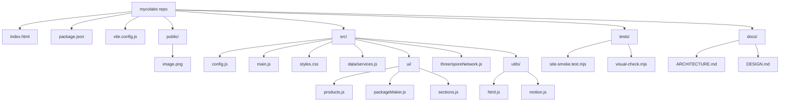

# Myco Labs Architecture

## 1. What This Project Is

This repo contains a static Vite website for Myco Labs. It is built with vanilla JavaScript, CSS, and Three.js. The page presents digital growth services for Gujarat manufacturers: websites, catalogues, WhatsApp bots, automation tools, IndiaMART improvement, Google Business Profile improvement, and SEO starter work.

This is not a Next.js or React app. There is no `app/`, `pages/`, `components/`, Tailwind config, or TypeScript config in the current repo.

## 2. Project Structure



## 3. Which File Controls Which Part

| File | Controls |
| --- | --- |
| `index.html` | Page shell, metadata, navigation, static section layout, static headings, static CTAs, and DOM hooks such as `data-product-tabs` and `data-package-options`. |
| `src/main.js` | App initialization: creates the Three.js scene, calls UI renderers, starts page motion, and registers cleanup. |
| `src/config.js` | Shared JavaScript runtime constants, currently including the WhatsApp URL for rendered product CTAs. |
| `src/data/services.js` | Service/product content used by JavaScript: product tab data, examples, chips, package options, package result copy, process steps, and growth signals. |
| `src/ui/products.js` | Product tabs, product detail cards, hero focus buttons, and product selection behavior. |
| `src/ui/packageMaker.js` | Package Maker option rendering, selection logic, selected pills, and package result updates. |
| `src/ui/sections.js` | Stateless rendering for process timeline steps and growth signal cards. |
| `src/styles.css` | All visual design, layout, responsive behavior, colors, typography, reveal animation styles, and component styling. |
| `src/three/sporeNetwork.js` | Three.js scene for the fixed WebGL hero canvas, product orbit, node network, focus colors, resize behavior, pointer motion, and animation loop. |
| `src/utils/html.js` | Shared HTML escaping helper for markup strings rendered from project data. |
| `src/utils/motion.js` | Header scroll state and reveal-on-scroll behavior. |
| `public/image.png` | Background image referenced by `src/styles.css` through `url('/image.png')`. |
| `vite.config.js` | Vite build config. It manually splits `three` into its own output chunk. |
| `package.json` | Project scripts and dependencies. |

## 4. Where To Edit Content Or Copy

Use `src/data/services.js` for most repeated service content:

- Product labels, titles, summaries, examples, chips, and featured CTA labels.
- Package Maker options and default checked states.
- Package result names and summaries.
- Process step copy.
- Growth signal cards.

Use `index.html` for page-level static copy:

- Page title and meta description.
- Header navigation labels.
- Hero heading, hero supporting copy, and trust strip labels.
- Section headings and section intro text.
- Static trust section and final contact CTA.
- WhatsApp links that are hardcoded in static anchor tags.

Use `src/ui/` files carefully for copy only when it is part of rendering logic. The shared product-card WhatsApp URL is stored in `src/config.js` as `whatsappHref`.

Current placeholder WhatsApp number: `910000000000`.

## 5. Where To Edit Design Or Styles

Edit `src/styles.css` for visual changes.

Important areas in that file:

- `:root` CSS variables for colors, radius, shadow, and font stack.
- Global page background and `body::before` image overlay.
- `#hero-canvas` placement and opacity.
- Header, navigation, buttons, hero, products, package maker, process, growth, trust, and contact section styling.
- Responsive layout rules and motion/reveal styles.

The site imports the Manrope font from Google Fonts at the top of `src/styles.css`.

## 6. Where To Edit Three.js Or Animation

Edit `src/three/sporeNetwork.js` for WebGL and Three.js behavior.

Key pieces:

- `focusOrder` defines the service IDs used by the animation.
- `focusColors` maps those service IDs to animation colors.
- `getConfig()` controls desktop/mobile node counts, radius, orbit radius, link distance, and pixel ratio.
- `createProductOrbit()` builds the orbit markers, rings, bars, panels, and beams.
- `createSporeNetwork(canvas)` creates the scene, camera, renderer, node network, animation loop, resize handling, pointer handling, `setFocus()`, and cleanup.

The service IDs in `focusOrder` should stay aligned with product IDs in `src/data/services.js`. The current IDs are `website`, `catalogue`, `whatsapp`, `growth`, and `automation`.

## 7. Where Tests Are Located

Tests are in `tests/`.

- `tests/site-smoke.test.mjs` checks page title, canvas visibility, required sections, expected text, product tabs, package defaults, and absence of older forbidden copy.
- `tests/visual-check.mjs` checks desktop/mobile layout, canvas pixels and frame movement, product tab interaction, hero focus interaction, package maker visibility, and writes screenshots to `test-artifacts/`.

Run commands:

```sh
npm run test:smoke
npm run test:visual
```

Both scripts expect a running site. By default they use `http://127.0.0.1:5173/`, or a custom `SITE_URL`.

## 8. Notes For Future AI Agents

- Do not edit app code when the task is documentation-only.
- Do not describe this repo as Next.js, React, Tailwind, or TypeScript unless those tools are actually added later.
- Keep `src/data/services.js` and `src/three/sporeNetwork.js` IDs in sync when adding or renaming product categories.
- Keep WhatsApp number changes consistent across `index.html` and `src/config.js`.
- Avoid adding public pricing unless the positioning docs change; the current site uses a Package Maker without public amounts.
- `dist/`, `node_modules/`, `test-artifacts/`, `.superpowers/`, `.claude/`, local progress trackers, generated planning docs, and draft asset folders are ignored by `.gitignore`.

## 9. Recommended Next Improvements

- Replace the placeholder WhatsApp number with the final business number.
- Add real manufacturer product categories and examples after discovery calls.
- Consider hydrating static WhatsApp links from `src/config.js` so future number changes do not require touching both `index.html` and JavaScript.
- Add real screenshots or generated visuals only if they improve trust and stay lightweight.
